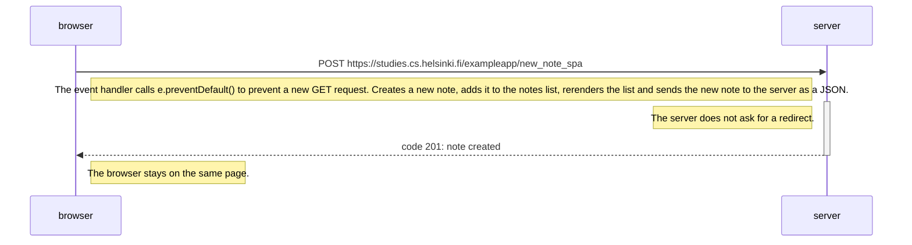

SPA

```mermaid
sequenceDiagram
    participant browser
    participant server

    browser->>server: POST https://studies.cs.helsinki.fi/exampleapp/new_note_spa
    Note right of browser: The event handler calls e.preventDefault() to prevent a new GET request. Creates a new note, adds it to the notes list, rerenders the list and sends the new note to the server as a JSON.

    activate server
    Note left of server: The server does not ask for a redirect.

    server-->>browser: code 201: note created
    deactivate server

    Note right of browser: The browser stays on the same page.
```
